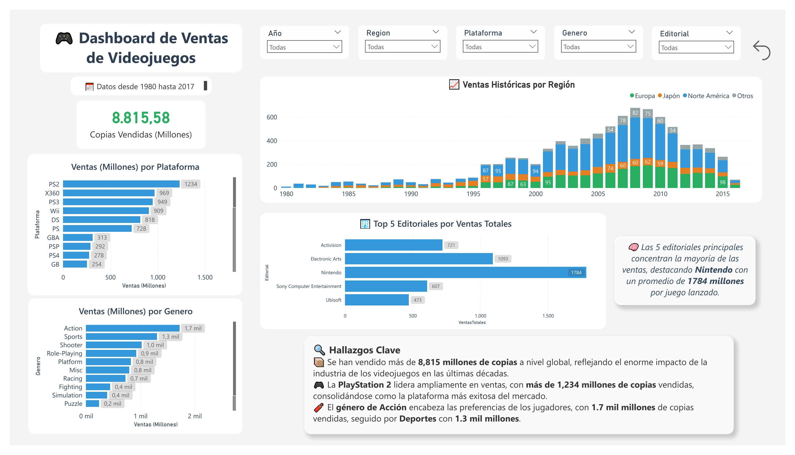
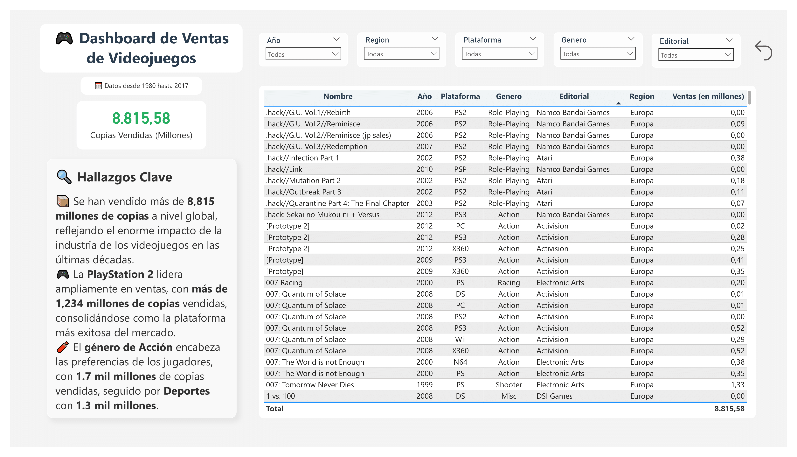

# 🎮 Video Game Sales Dashboard

Dashboard interactivo hecho en Power BI para analizar las ventas globales de videojuegos desde 1980 hasta 2017. Este proyecto explora tendencias por plataforma, género, región y editorial.

---

## 📊 Visualizaciones destacadas

- Ventas por plataforma
- Ventas por género
- Evolución regional de las ventas
- Editoriales con mayores ventas
- Tabla de detalles por juego

---

## 🔍 Hallazgos clave

- **PS2 lidera en ventas**, con más de 1234 millones de copias vendidas.
- **El género de Acción es el más popular**, seguido por Deportes.
- **Nintendo domina el top 10** de juegos más vendidos.
- **Caída progresiva en ventas** después de 2010, posible transición al mercado digital.

---

## 📁 Estructura del proyecto

├── VideoGame_Sales.pbix ├── README.md ├── images/ │ ├── dashboard_main.png │ └── dashboard_table.png ├── data/ │ └── videojuegos_ventas.csv

---

## 📷 Vista previa

### Dashboard principal

### Tabla de detalle

---

## 👩‍💻 Autor

**Andrea**  
Analista de datos | Automatización de procesos | Visualización & BI  
[LinkedIn]([https://www.linkedin.com/in/tu-usuario](https://www.linkedin.com/in/andreameroussis/))

---
